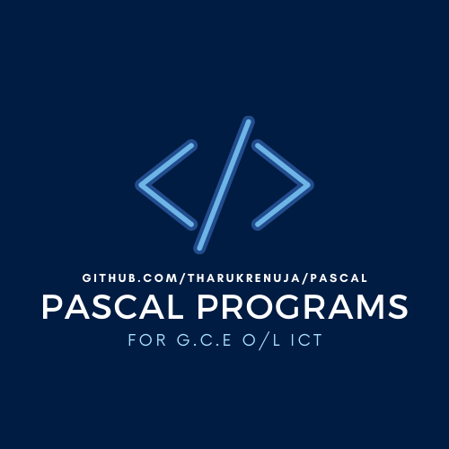

# Simple Pascal Programs
Simple Pascal Programs for G.C.E. O/L ICT Examination

<p align="middle">
  
</p>
<p align="center">
  <a href="https://github.com/TharukRenuja/Pascal">
    
  </a>
</p>

### Pascal Hello World Example
A simple pascal code that would print the words "Hello, World!"
```
program HelloWorld(input,output);

begin
   writeln('Hello, World!');
   readln();
end.
```

#### Standard data types in Pascal

- Integer - Plus or minus whole numbers
  ``` Example : 0, 46, -12 ```
- Real - Plus or minus decimal numbers
  ``` Example : 0.0, 25.68 ```
- Boolean
  ``` True or False ```
- Char - Any character of the key board
  ``` Example : ‘k’, ‘#’, ‘7‘ ```
- String - Any sequence of characters
  ``` Example : ‘ICT’, ‘programming’, ‘Pascal’ ```
